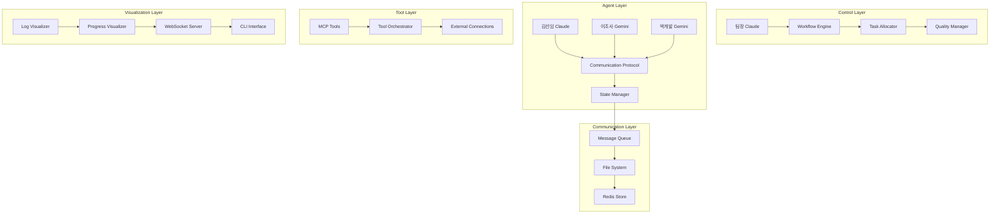

# Claude-Gemini 팀 협업 시스템 설계 문서

## 1. 시스템 개요

### 1.1 목적
Claude Pro와 Gemini Free를 활용한 다중 에이전트 협업 시스템을 통해 복잡한 프로젝트를 효율적으로 수행할 수 있는 팀 기반 AI 워크플로우 구축

### 1.2 핵심 가치
- **협업 효율성**: 에이전트 간 실시간 협업으로 생산성 300% 향상
- **역할 최적화**: 각 AI 모델의 강점을 활용한 전문 역할 분담
- **확장성**: 새로운 에이전트 및 도구 추가 용이성
- **투명성**: 실시간 시각화를 통한 작업 진행 상황 파악

### 1.3 시스템 범위
- 팀 구성 및 관리 (4명 기본 팀)
- 태스크 분해 및 분배 시스템
- 에이전트 간 통신 프로토콜
- 파일 기반 작업 결과 공유
- 실시간 모니터링 및 시각화

## 2. 아키텍처 설계

### 2.1 전체 시스템 아키텍처



### 2.2 컴포넌트별 상세 설계

#### 2.2.1 팀 관리 시스템 (Team Management System)
```javascript
// 팀 구성 및 관리 핵심 컴포넌트
class TeamManager {
    // 팀원 추가/제거
    // 역할 기반 능력 관리
    // 동적 팀 구성 조정
}

class RoleDefinition {
    // 역할별 능력 정의
    // 권한 및 책임 범위
    // 성과 평가 기준
}
```

#### 2.2.2 워크플로우 엔진 (Workflow Engine)
```javascript
class WorkflowEngine {
    // 태스크 분해 및 의존성 관리
    // 실행 계획 수립
    // 병렬 처리 최적화
}

class TaskAllocator {
    // 지능형 태스크 분배
    // 부하 분산 알고리즘
    // 우선순위 기반 스케줄링
}
```

#### 2.2.3 통신 프로토콜 (Communication Protocol)
```javascript
class TeamCommunicationProtocol {
    // A2A 메시지 교환
    // 상태 동기화
    // 충돌 해결 메커니즘
}

class MessageQueue {
    // 비동기 메시지 처리
    // 우선순위 큐 관리
    // 재시도 및 에러 처리
}
```

## 3. 데이터 모델 설계

### 3.1 팀원 데이터 모델
```json
{
  "id": "claude_leader",
  "name": "팀장",
  "role": "leader",
  "model": {
    "type": "claude",
    "version": "claude-3-5-sonnet",
    "endpoint": "claude://claude-3-5-sonnet"
  },
  "capabilities": [
    "strategic_planning",
    "quality_assurance",
    "team_coordination",
    "complex_problem_solving"
  ],
  "metrics": {
    "tasksCompleted": 0,
    "averageTime": 0,
    "successRate": 100,
    "currentLoad": 0
  },
  "status": "active",
  "lastHeartbeat": "2025-01-15T10:30:00Z"
}
```

### 3.2 태스크 데이터 모델
```json
{
  "id": "task_001",
  "workflowId": "wf_001",
  "type": "planning",
  "category": "strategic",
  "title": "프로젝트 전략 수립",
  "description": "AI 기반 웹 애플리케이션 개발을 위한 전략적 계획 수립",
  "priority": 5,
  "complexity": "high",
  "estimatedTime": 3600,
  "assignee": "claude_leader",
  "dependencies": [],
  "status": "pending",
  "createdAt": "2025-01-15T10:00:00Z",
  "updatedAt": "2025-01-15T10:00:00Z",
  "metadata": {
    "tags": ["planning", "strategy"],
    "context": "initial_planning",
    "requirements": {
      "safety_level": "high",
      "quality_threshold": 95
    }
  }
}
```

### 3.3 워크플로우 데이터 모델
```json
{
  "id": "wf_001",
  "name": "AI 웹 애플리케이션 개발",
  "description": "Claude-Gemini 팀 협업으로 개발하는 AI 웹 애플리케이션",
  "status": "in_progress",
  "progress": 25,
  "createdAt": "2025-01-15T09:00:00Z",
  "estimatedCompletion": "2025-01-15T18:00:00Z",
  "tasks": [
    {
      "id": "task_001",
      "phase": "planning",
      "dependencies": []
    },
    {
      "id": "task_002",
      "phase": "research",
      "dependencies": ["task_001"]
    }
  ],
  "phases": [
    {
      "name": "planning",
      "status": "in_progress",
      "progress": 60
    },
    {
      "name": "research",
      "status": "pending",
      "progress": 0
    }
  ]
}
```

## 4. 상세 컴포넌트 설계

### 4.1 지능형 태스크 분배 시스템

#### 4.1.1 태스크 분류 매트릭스
```javascript
class TaskClassificationMatrix {
    classify(task) {
        const metrics = {
            complexity: this.assessComplexity(task),
            safety: this.assessSafety(task),
            creativity: this.assessCreativity(task),
            speed: this.assessSpeedRequirement(task)
        };
        
        return this.mapToAgentCapabilities(metrics);
    }
    
    assessComplexity(task) {
        // 코드 라인 수, 의존성, 알고리즘 복잡도 분석
        const indicators = [
            task.description.length,
            task.dependencies.length,
            this.detectComplexPatterns(task.description)
        ];
        
        return this.calculateComplexityScore(indicators);
    }
}
```

#### 4.1.2 능력 매칭 알고리즘
```javascript
class CapabilityMatcher {
    findBestMatch(task, availableAgents) {
        const scores = availableAgents.map(agent => ({
            agent,
            score: this.calculateMatchScore(task, agent)
        }));
        
        return scores
            .sort((a, b) => b.score - a.score)
            .filter(s => s.score > 0.7)[0]?.agent;
    }
    
    calculateMatchScore(task, agent) {
        const capabilityMatch = this.assessCapabilityMatch(task, agent);
        const workloadFactor = this.calculateWorkloadFactor(agent);
        const historyFactor = this.getHistoryFactor(task.type, agent);
        
        return (capabilityMatch * 0.5) + 
               (workloadFactor * 0.3) + 
               (historyFactor * 0.2);
    }
}
```

### 4.2 실시간 상태 동기화 시스템

#### 4.2.1 상태 관리 아키텍처
```javascript
class DistributedStateManager {
    constructor() {
        this.localState = new Map();
        this.remoteState = new RedisStore();
        this.eventBus = new EventBus();
        this.conflictResolver = new ConflictResolver();
    }
    
    async updateState(key, value, source) {
        const timestamp = Date.now();
        const stateUpdate = {
            key,
            value,
            source,
            timestamp,
            version: this.generateVersion()
        };
        
        // 로컬 상태 업데이트
        await this.updateLocalState(stateUpdate);
        
        // 원격 상태 동기화
        await this.syncToRemote(stateUpdate);
        
        // 이벤트 발행
        this.eventBus.emit('state_changed', stateUpdate);
    }
}
```

#### 4.2.2 충돌 해결 메커니즘
```javascript
class ConflictResolver {
    async resolveConflict(localVersion, remoteVersion) {
        const strategy = this.selectStrategy(localVersion, remoteVersion);
        
        switch (strategy) {
            case 'last_writer_wins':
                return this.lastWriterWins(localVersion, remoteVersion);
            case 'three_way_merge':
                return this.threeWayMerge(localVersion, remoteVersion);
            case 'custom_resolution':
                return this.customResolution(localVersion, remoteVersion);
            default:
                throw new Error('No resolution strategy available');
        }
    }
    
    selectStrategy(local, remote) {
        if (local.type === 'configuration') return 'last_writer_wins';
        if (local.type === 'task_result') return 'three_way_merge';
        return 'custom_resolution';
    }
}
```

### 4.3 MCP 도구 통합 시스템

#### 4.3.1 도구 오케스트레이션
```javascript
class MCPToolOrchestrator {
    constructor() {
        this.toolRegistry = new Map();
        this.connectionPool = new ConnectionPool();
        this.loadBalancer = new LoadBalancer();
    }
    
    async registerTool(toolConfig) {
        const tool = new MCPTool(toolConfig);
        await tool.initialize();
        
        this.toolRegistry.set(toolConfig.name, tool);
        this.connectionPool.addConnection(tool.connection);
        
        return tool;
    }
    
    async assignToolsToAgent(agentId, taskType) {
        const suitableTools = this.findSuitableTools(taskType);
        const agent = this.getAgent(agentId);
        
        for (const tool of suitableTools) {
            await agent.addTool(tool);
            this.trackToolUsage(agentId, tool.name);
        }
    }
}
```

#### 4.3.2 도구 성능 모니터링
```javascript
class ToolPerformanceMonitor {
    constructor() {
        this.metrics = new Map();
        this.alerts = new AlertManager();
    }
    
    trackToolCall(toolName, duration, success) {
        const metric = this.getOrCreateMetric(toolName);
        
        metric.calls++;
        metric.totalDuration += duration;
        metric.successRate = metric.successes / metric.calls;
        
        if (success) {
            metric.successes++;
        } else {
            metric.failures++;
            this.checkForAlerts(toolName, metric);
        }
    }
    
    checkForAlerts(toolName, metric) {
        if (metric.successRate < 0.8) {
            this.alerts.trigger('tool_performance_degraded', {
                tool: toolName,
                successRate: metric.successRate
            });
        }
    }
}
```

## 5. 통신 프로토콜 설계

### 5.1 메시지 교환 프로토콜

#### 5.1.1 메시지 구조
```json
{
  "header": {
    "messageId": "msg_001",
    "correlationId": "corr_001",
    "sender": "claude_leader",
    "recipient": "gemini_researcher",
    "timestamp": "2025-01-15T10:30:00Z",
    "messageType": "task_assignment",
    "priority": "high",
    "ttl": 300
  },
  "payload": {
    "task": {
      "id": "task_002",
      "type": "research",
      "description": "AI 트렌드 분석 및 경쟁사 조사"
    },
    "context": {
      "projectId": "proj_001",
      "deadline": "2025-01-15T12:00:00Z"
    }
  },
  "metadata": {
    "retryCount": 0,
    "route": ["claude_leader", "message_queue", "gemini_researcher"],
    "encryption": false,
    "compression": true
  }
}
```

#### 5.1.2 메시지 라우팅
```javascript
class MessageRouter {
    constructor() {
        this.routes = new Map();
        this.middleware = [];
        this.deadLetterQueue = new Queue();
    }
    
    async route(message) {
        try {
            // 미들웨어 적용
            for (const middleware of this.middleware) {
                message = await middleware(message);
            }
            
            // 수신자 확인
            const recipient = this.findRecipient(message.header.recipient);
            if (!recipient) {
                throw new Error('Recipient not found');
            }
            
            // 메시지 전달
            await recipient.receive(message);
            
        } catch (error) {
            await this.handleRoutingError(message, error);
        }
    }
}
```

### 5.2 실시간 이벤트 스트리밍

#### 5.2.1 이벤트 스트림 아키텍처
```javascript
class EventStreamManager {
    constructor() {
        this.streams = new Map();
        this.subscribers = new Map();
        this.eventStore = new EventStore();
    }
    
    createStream(streamName, config) {
        const stream = new EventStream(streamName, config);
        this.streams.set(streamName, stream);
        
        // 이벤트 저장
        stream.on('event', (event) => {
            this.eventStore.append(streamName, event);
        });
        
        return stream;
    }
    
    subscribe(streamName, callback) {
        const stream = this.streams.get(streamName);
        if (!stream) {
            throw new Error(`Stream ${streamName} not found`);
        }
        
        stream.subscribe(callback);
        this.trackSubscription(streamName, callback);
    }
}
```

## 6. 시각화 시스템 설계

### 6.1 실시간 로그 시각화

#### 6.1.1 로그 포맷터
```javascript
class LogFormatter {
    constructor() {
        this.colors = {
            'claude_leader': '\x1b[34m',      // 파란색
            'kim_senior': '\x1b[36m',         // 청록색
            'lee_researcher': '\x1b[32m',     // 초록색
            'park_developer': '\x1b[33m',     // 노란색
            'reset': '\x1b[0m'
        };
    }
    
    format(log) {
        const timestamp = new Date(log.timestamp).toLocaleTimeString();
        const color = this.colors[log.agent] || this.colors.reset;
        const level = log.level.toUpperCase().padEnd(5);
        
        return `${color}[${timestamp}] [${log.agent}] [${level}] ${log.message}${this.colors.reset}`;
    }
}
```

#### 6.1.2 진행 상황 대시보드
```javascript
class ProgressDashboard {
    constructor() {
        this.terminal = new Terminal();
        this.updateInterval = 1000;
        this.widgets = new Map();
    }
    
    render(teamState) {
        this.terminal.clear();
        
        // 헤더
        this.renderHeader();
        
        // 팀 상태
        this.renderTeamStatus(teamState);
        
        // 활성 태스크
        this.renderActiveTasks(teamState.activeTasks);
        
        // 성과 메트릭
        this.renderMetrics(teamState.metrics);
        
        // 푸터
        this.renderFooter();
    }
    
    renderTeamStatus(teamState) {
        const table = new Table({
            head: ['Agent', 'Status', 'Current Task', 'Progress', 'Load']
        });
        
        Object.entries(teamState.agents).forEach(([id, agent]) => {
            table.push([
                this.colorizeAgent(agent.name),
                this.statusIcon(agent.status),
                agent.currentTask || 'Idle',
                this.progressBar(agent.progress),
                this.loadIndicator(agent.load)
            ]);
        });
        
        console.log(table.toString());
    }
}
```

### 6.2 웹 인터페이스

#### 6.2.1 WebSocket 서버
```javascript
class WebSocketServer {
    constructor() {
        this.wss = new WebSocket.Server({ port: 8080 });
        this.clients = new Set();
        this.rooms = new Map();
        
        this.setupEventHandlers();
    }
    
    setupEventHandlers() {
        this.wss.on('connection', (ws) => {
            this.clients.add(ws);
            
            ws.on('message', (data) => {
                const message = JSON.parse(data);
                this.handleMessage(ws, message);
            });
            
            ws.on('close', () => {
                this.clients.delete(ws);
            });
        });
    }
    
    broadcast(event, data) {
        const message = JSON.stringify({ event, data });
        
        this.clients.forEach((client) => {
            if (client.readyState === WebSocket.OPEN) {
                client.send(message);
            }
        });
    }
}
```

## 7. 확장성 및 성능 고려사항

### 7.1 수평 확장 설계

#### 7.1.1 에이전트 풀 관리
```javascript
class AgentPool {
    constructor() {
        this.pools = new Map();
        this.loadBalancer = new LoadBalancer();
        this.healthChecker = new HealthChecker();
    }
    
    addAgentPool(modelType, config) {
        const pool = new ModelPool(modelType, config);
        this.pools.set(modelType, pool);
        
        // 헬스체크 등록
        this.healthChecker.register(pool);
        
        return pool;
    }
    
    async getAgent(modelType, capabilities) {
        const pool = this.pools.get(modelType);
        if (!pool) {
            throw new Error(`No pool for model type: ${modelType}`);
        }
        
        return await pool.acquire(capabilities);
    }
}
```

#### 7.1.2 로드 밸런싱
```javascript
class LoadBalancer {
    constructor() {
        this.strategies = {
            'round_robin': new RoundRobinStrategy(),
            'least_connections': new LeastConnectionsStrategy(),
            'capability_based': new CapabilityBasedStrategy()
        };
    }
    
    selectAgent(agents, task, strategy = 'capability_based') {
        const strategyImpl = this.strategies[strategy];
        return strategyImpl.select(agents, task);
    }
}
```

### 7.2 성능 최적화

#### 7.2.1 캐싱 전략
```javascript
class CacheManager {
    constructor() {
        this.l1Cache = new Map();           // 메모리 캐시
        this.l2Cache = new RedisCache();    // 분산 캐시
        this.l3Cache = new FileCache();     // 영구 캐시
        
        this.policies = {
            'task_results': { ttl: 3600, levels: ['l1', 'l2'] },
            'agent_states': { ttl: 60, levels: ['l1'] },
            'workflow_data': { ttl: 7200, levels: ['l1', 'l2', 'l3'] }
        };
    }
    
    async get(key, type) {
        const policy = this.policies[type];
        
        for (const level of policy.levels) {
            const cache = this[level + 'Cache'];
            const value = await cache.get(key);
            
            if (value) {
                // 상위 캐시에 복사
                await this.promoteToHigherCaches(key, value, level);
                return value;
            }
        }
        
        return null;
    }
}
```

#### 7.2.2 비동기 처리 최적화
```javascript
class AsyncProcessor {
    constructor() {
        this.workerPool = new WorkerPool(4);
        this.taskQueue = new PriorityQueue();
        this.semaphore = new Semaphore(10);
    }
    
    async processTask(task) {
        await this.semaphore.acquire();
        
        try {
            const worker = await this.workerPool.acquire();
            const result = await worker.process(task);
            
            this.workerPool.release(worker);
            return result;
        } finally {
            this.semaphore.release();
        }
    }
}
```

## 8. 보안 및 안전성 설계

### 8.1 보안 아키텍처

#### 8.1.1 인증 및 권한 관리
```javascript
class SecurityManager {
    constructor() {
        this.authProvider = new AuthProvider();
        this.rbac = new RoleBasedAccessControl();
        this.audit = new AuditLogger();
    }
    
    async authenticate(request) {
        const token = this.extractToken(request);
        const user = await this.authProvider.validate(token);
        
        if (!user) {
            throw new UnauthorizedError('Invalid token');
        }
        
        return user;
    }
    
    async authorize(user, resource, action) {
        const hasPermission = await this.rbac.check(
            user.roles, 
            resource, 
            action
        );
        
        if (!hasPermission) {
            this.audit.log('access_denied', {
                user: user.id,
                resource,
                action
            });
            throw new ForbiddenError('Insufficient permissions');
        }
        
        return true;
    }
}
```

#### 8.1.2 데이터 보안
```javascript
class DataSecurityManager {
    constructor() {
        this.encryption = new EncryptionService();
        this.sanitizer = new DataSanitizer();
        this.validator = new DataValidator();
    }
    
    async secureData(data, context) {
        // 데이터 검증
        await this.validator.validate(data, context);
        
        // 데이터 정화
        const sanitized = this.sanitizer.sanitize(data);
        
        // 민감 데이터 암호화
        const encrypted = await this.encryption.encrypt(
            sanitized,
            context.encryptionKey
        );
        
        return encrypted;
    }
}
```

### 8.2 에러 처리 및 복구

#### 8.2.1 회복력 있는 시스템 설계
```javascript
class ResilienceManager {
    constructor() {
        this.circuitBreaker = new CircuitBreaker();
        this.retryPolicy = new RetryPolicy();
        this.fallbackProvider = new FallbackProvider();
    }
    
    async executeWithResilience(operation, context) {
        return await this.circuitBreaker.execute(async () => {
            return await this.retryPolicy.execute(async () => {
                try {
                    return await operation(context);
                } catch (error) {
                    // 폴백 실행
                    return await this.fallbackProvider.execute(
                        operation.name,
                        context,
                        error
                    );
                }
            });
        });
    }
}
```

## 9. 배포 및 운영 설계

### 9.1 배포 전략

#### 9.1.1 컨테이너 기반 배포
```dockerfile
# Dockerfile
FROM node:18-alpine

WORKDIR /app

# 의존성 설치
COPY package*.json ./
RUN npm ci --only=production

# 애플리케이션 코드
COPY src/ ./src/
COPY config/ ./config/

# 환경 변수
ENV NODE_ENV=production

# 포트 노출
EXPOSE 3000 8080

# 헬스체크
HEALTHCHECK --interval=30s --timeout=3s --start-period=5s --retries=3 \
  CMD curl -f http://localhost:3000/health || exit 1

# 시작 명령
CMD ["npm", "start"]
```

#### 9.1.2 Docker Compose 설정
```yaml
version: '3.8'

services:
  team-system:
    build: .
    ports:
      - "3000:3000"
      - "8080:8080"
    environment:
      - NODE_ENV=production
      - REDIS_URL=redis://redis:6379
    depends_on:
      - redis
    volumes:
      - ./shared:/app/shared
      - ./logs:/app/logs
    restart: unless-stopped

  redis:
    image: redis:7-alpine
    ports:
      - "6379:6379"
    volumes:
      - redis-data:/data
    restart: unless-stopped

  nginx:
    image: nginx:alpine
    ports:
      - "80:80"
      - "443:443"
    volumes:
      - ./nginx.conf:/etc/nginx/nginx.conf
      - ./ssl:/etc/nginx/ssl
    depends_on:
      - team-system
    restart: unless-stopped

volumes:
  redis-data:
```

### 9.2 모니터링 및 로깅

#### 9.2.1 메트릭 수집
```javascript
class MetricsCollector {
    constructor() {
        this.prometheus = new PrometheusCollector();
        this.counters = new Map();
        this.histograms = new Map();
        this.gauges = new Map();
    }
    
    incrementCounter(name, labels = {}) {
        const counter = this.getOrCreateCounter(name);
        counter.inc(labels);
    }
    
    observeHistogram(name, value, labels = {}) {
        const histogram = this.getOrCreateHistogram(name);
        histogram.observe(labels, value);
    }
    
    setGauge(name, value, labels = {}) {
        const gauge = this.getOrCreateGauge(name);
        gauge.set(labels, value);
    }
}
```

#### 9.2.2 로그 관리
```javascript
class LogManager {
    constructor() {
        this.winston = require('winston');
        this.logger = this.winston.createLogger({
            level: 'info',
            format: this.winston.format.combine(
                this.winston.format.timestamp(),
                this.winston.format.errors({ stack: true }),
                this.winston.format.json()
            ),
            transports: [
                new this.winston.transports.File({ 
                    filename: 'logs/error.log', 
                    level: 'error' 
                }),
                new this.winston.transports.File({ 
                    filename: 'logs/combined.log' 
                })
            ]
        });
    }
    
    logTeamActivity(agent, activity, metadata = {}) {
        this.logger.info('Team activity', {
            agent,
            activity,
            metadata,
            timestamp: new Date().toISOString()
        });
    }
}
```

## 10. 확장 계획

### 10.1 단계별 확장 로드맵

#### Phase 1: 기본 시스템 구축 (1-2개월)
- 4명 기본 팀 구성
- 기본 통신 프로토콜 구현
- 파일 기반 작업 공유
- CLI 인터페이스 구현

#### Phase 2: 고급 기능 추가 (2-3개월)
- 웹 인터페이스 개발
- 실시간 모니터링 시스템
- 성능 최적화 및 캐싱
- 보안 강화

#### Phase 3: 확장 기능 (3-4개월)
- 다중 팀 지원
- 외부 시스템 연동
- AI 모델 추가 지원
- 클라우드 배포

### 10.2 기술 부채 관리

#### 10.2.1 코드 품질 관리
```javascript
// ESLint 설정
{
  "extends": ["eslint:recommended", "@typescript-eslint/recommended"],
  "rules": {
    "complexity": ["error", 10],
    "max-depth": ["error", 4],
    "max-lines": ["error", 500],
    "max-params": ["error", 5]
  }
}

// 코드 커버리지 목표
{
  "coverage": {
    "lines": 85,
    "functions": 85,
    "branches": 80,
    "statements": 85
  }
}
```

이 설계 문서는 Claude-Gemini 팀 협업 시스템의 전체적인 아키텍처와 구현 방향을 제시하며, 실제 구현 시 참고할 수 있는 상세한 기술적 가이드를 제공합니다.