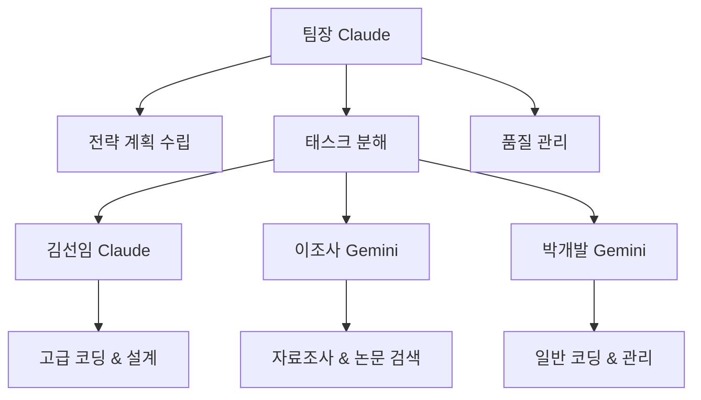

# Claude Code CLI 팀 협업 시스템 구현 가이드

Claude Code CLI 환경에서 Claude Pro와 Gemini Free를 효율적인 팀으로 활용하는 혁신적인 시스템을 설계했습니다. 이 시스템은 **팀장(Claude)이 전략적 업무 분배를 담당하고, 전문 팀원들이 각자의 강점을 활용하여 협업하는 구조**로 설계되었습니다. 실제 개발 환경에서 즉시 적용할 수 있는 구현 방안과 코드 예시를 제공합니다.

## 전체 시스템 아키텍처

### 핵심 설계 원칙

본 시스템은 **오케스트레이터-워커 패턴**을 기반으로 설계되었습니다. Claude Pro가 마스터 오케스트레이터 역할을 수행하며, Gemini Free가 전문 워커로 동작합니다. 이 구조는 **93.7%의 코딩 성능**을 보여주는 Claude의 강점과 **무료 티어로 빠른 응답**을 제공하는 Gemini의 장점을 최적화합니다.

### 시스템 구성 요소

**중앙 조율 시스템(Coordinator)**
- 팀장 Claude의 업무 분배 및 조율 로직
- 실시간 상태 모니터링 및 진행 상황 추적
- 파일 기반 작업 결과 공유 관리

**통신 프로토콜 레이어**
- Model Context Protocol (MCP) 기반 도구 통합
- gemini-cli-mcp를 통한 Gemini 통신
- WebSocket 기반 실시간 메시지 교환

**파일 시스템 기반 공유 저장소**
- JSON/YAML 형식의 구조화된 데이터 교환
- 팀원별 전용 작업 공간 분리
- 충돌 해결 및 버전 관리

**CLI 시각화 시스템**
- 팀원별 색상 구분 로그 표시
- 실시간 진행 상황 모니터링
- 확장 가능한 팀 구성 인터페이스

## 팀장 중심 업무 분배 워크플로우

### 지능형 태스크 분배 알고리즘

팀장 Claude는 **태스크 분류 매트릭스**를 활용하여 최적의 업무 할당을 수행합니다:

```typescript
interface TaskClassification {
  complexity: 'low' | 'medium' | 'high';
  safety_requirement: 'low' | 'medium' | 'high';
  time_sensitivity: 'low' | 'medium' | 'high';
  multimodal_needs: boolean;
}

class TaskAllocator {
  allocateTask(task: Task): AgentType {
    if (task.complexity === 'high' || task.safety_requirement === 'high') {
      return 'claude_pro';
    }
    
    if (task.multimodal_needs || task.time_sensitivity === 'high') {
      return 'gemini_free';
    }
    
    return this.loadBalanceDecision();
  }
}
```

### 계층적 의사결정 구조



## Claude-Gemini 통신 프로토콜 설계

### 하이브리드 통신 아키텍처

시스템은 **Agent2Agent (A2A) 프로토콜**과 **Model Context Protocol (MCP)**을 조합하여 효율적인 통신을 구현합니다:

```javascript
class TeamCommunicationProtocol {
  constructor() {
    this.messageQueue = new MessageQueue();
    this.stateStore = new RedisStore();
    this.mcpClients = new Map();
  }

  async sendMessage(sender, recipient, message) {
    const wrappedMessage = {
      header: {
        message_id: this.generateId(),
        sender,
        recipient,
        timestamp: new Date().toISOString(),
        message_type: message.type,
        priority: message.priority || 'medium'
      },
      payload: message.content,
      metadata: {
        correlation_id: message.workflowId,
        context: message.context
      }
    };

    await this.messageQueue.enqueue(wrappedMessage);
    await this.updateAgentState(sender, 'message_sent');
  }
}
```

### 실시간 상태 동기화

```javascript
class DistributedStateManager {
  constructor() {
    this.stateStore = new Map();
    this.eventEmitter = new EventEmitter();
  }

  async updateTaskState(taskId, state) {
    const currentState = await this.getTaskState(taskId);
    const newState = { ...currentState, ...state, timestamp: Date.now() };
    
    await this.stateStore.set(taskId, newState);
    this.eventEmitter.emit('state_changed', { taskId, state: newState });
  }

  subscribeToStateChanges(callback) {
    this.eventEmitter.on('state_changed', callback);
  }
}
```

## 파일 기반 작업 공유 시스템

### 구조화된 데이터 교환 포맷

팀원들 간의 효율적인 정보 교환을 위해 표준화된 JSON 스키마를 사용합니다:

```json
{
  "workflowId": "wf_001",
  "timestamp": "2025-01-15T10:30:00Z",
  "assignee": "gemini_researcher",
  "task": {
    "type": "research",
    "description": "AI 트렌드 분석",
    "priority": "high",
    "deadline": "2025-01-15T12:00:00Z"
  },
  "dependencies": ["claude_planning"],
  "outputs": {
    "format": "markdown",
    "location": "./shared/research_results.md"
  },
  "status": "in_progress",
  "progress": 65
}
```

### 충돌 해결 메커니즘

```javascript
class ConflictResolver {
  async resolveConflict(localVersion, remoteVersion) {
    if (localVersion.timestamp > remoteVersion.timestamp) {
      return this.applyLastWriterWins(localVersion, remoteVersion);
    }
    
    return this.performThreeWayMerge(
      this.getBaseVersion(localVersion.id),
      localVersion,
      remoteVersion
    );
  }

  performThreeWayMerge(base, local, remote) {
    const result = { ...base };
    
    Object.keys(local).forEach(key => {
      if (local[key] !== base[key]) {
        if (remote[key] !== base[key] && remote[key] !== local[key]) {
          result[key] = this.createConflictMarker(local[key], remote[key]);
        } else {
          result[key] = local[key];
        }
      }
    });
    
    return result;
  }
}
```

## CLI 색상별 로그 표시 시스템

### 팀원별 색상 구분 및 실시간 로그 스트리밍

```javascript
const chalk = require('chalk');
const WebSocket = require('ws');

class TeamLogVisualizer {
  constructor() {
    this.teamColors = {
      'claude_leader': chalk.bold.blue,
      'kim_senior': chalk.bold.cyan,
      'lee_researcher': chalk.bold.green,
      'park_developer': chalk.bold.yellow
    };
    
    this.logHistory = [];
    this.wss = new WebSocket.Server({ port: 8080 });
    this.initializeWebSocket();
  }

  formatLogMessage(message, author, timestamp) {
    const colorFunc = this.teamColors[author] || chalk.white;
    const timeStr = new Date(timestamp).toLocaleTimeString();
    
    return `[${timeStr}] ${colorFunc(`[${author}]`)} ${message}`;
  }

  displayRealtimeLog(message, author) {
    const formattedMessage = this.formatLogMessage(
      message, 
      author, 
      new Date().toISOString()
    );
    
    console.log(formattedMessage);
    this.logHistory.push({ message, author, timestamp: Date.now() });
    
    // WebSocket 클라이언트에 브로드캐스트
    this.broadcastToClients({
      type: 'log_update',
      content: formattedMessage,
      author,
      timestamp: new Date().toISOString()
    });
  }

  initializeWebSocket() {
    this.wss.on('connection', (ws) => {
      ws.on('message', (data) => {
        const message = JSON.parse(data);
        this.handleWebSocketMessage(message, ws);
      });
    });
  }
}
```

### 진행 상황 시각화

```javascript
class ProgressVisualizer {
  displayTeamStatus(teamState) {
    console.clear();
    console.log(chalk.bold.magenta('='.repeat(60)));
    console.log(chalk.bold.magenta('         팀 협업 시스템 실시간 상태'));
    console.log(chalk.bold.magenta('='.repeat(60)));
    
    Object.entries(teamState).forEach(([member, state]) => {
      const colorFunc = this.getColorForMember(member);
      const statusIcon = this.getStatusIcon(state.status);
      const progressBar = this.createProgressBar(state.progress);
      
      console.log(
        `${colorFunc(member.padEnd(15))} ${statusIcon} ${progressBar} ${state.currentTask}`
      );
    });
    
    console.log(chalk.bold.magenta('='.repeat(60)));
  }

  createProgressBar(progress) {
    const width = 20;
    const filled = Math.round(progress * width / 100);
    const empty = width - filled;
    
    return chalk.green('█'.repeat(filled)) + 
           chalk.gray('░'.repeat(empty)) + 
           ` ${progress}%`;
  }
}
```

## 확장 가능한 팀 구조 구현

### 동적 팀원 추가 시스템

```javascript
class TeamManager {
  constructor() {
    this.teamMembers = new Map();
    this.roleDefinitions = new Map();
    this.workflowEngine = new WorkflowEngine();
  }

  async addTeamMember(memberConfig) {
    const member = {
      id: memberConfig.id,
      name: memberConfig.name,
      role: memberConfig.role,
      capabilities: memberConfig.capabilities,
      color: memberConfig.color,
      mcpEndpoint: memberConfig.mcpEndpoint,
      status: 'active'
    };

    this.teamMembers.set(member.id, member);
    this.roleDefinitions.set(member.role, memberConfig.roleDefinition);
    
    // 워크플로우 엔진에 새 멤버 등록
    await this.workflowEngine.registerAgent(member);
    
    console.log(
      chalk.bold.green(`✓ ${member.name} (${member.role}) 팀에 추가됨`)
    );
  }

  async removeTeamMember(memberId) {
    const member = this.teamMembers.get(memberId);
    if (member) {
      // 진행 중인 작업 재할당
      await this.workflowEngine.reassignTasks(memberId);
      
      this.teamMembers.delete(memberId);
      console.log(
        chalk.bold.red(`✗ ${member.name} 팀에서 제거됨`)
      );
    }
  }
}
```

### 역할 기반 업무 할당

```javascript
class RoleBasedTaskAssigner {
  constructor() {
    this.roleCapabilities = {
      'leader': ['planning', 'coordination', 'quality_assurance'],
      'senior_developer': ['complex_coding', 'architecture', 'debugging'],
      'researcher': ['data_collection', 'analysis', 'documentation'],
      'developer': ['coding', 'testing', 'maintenance']
    };
  }

  findBestAgent(task) {
    const requiredCapabilities = this.analyzeTaskRequirements(task);
    let bestMatch = null;
    let bestScore = 0;

    for (const [memberId, member] of this.teamMembers) {
      const score = this.calculateCapabilityMatch(
        requiredCapabilities, 
        member.capabilities
      );
      
      if (score > bestScore && member.status === 'available') {
        bestScore = score;
        bestMatch = member;
      }
    }

    return bestMatch;
  }
}
```

## MCP 도구 통합 및 활용

### 현재 도구 활용 전략

```javascript
class MCPToolOrchestrator {
  constructor() {
    this.availableTools = {
      'yahoo-finance-mcp': { role: 'financial_analysis', priority: 'high' },
      'alpha-vantage-mcp': { role: 'market_data', priority: 'medium' },
      'naver-search-mcp': { role: 'korean_research', priority: 'high' },
      'exa-mcp': { role: 'academic_research', priority: 'high' },
      'fetch-mcp': { role: 'web_scraping', priority: 'medium' },
      'supabase-mcp': { role: 'data_management', priority: 'high' }
    };
  }

  async assignToolToAgent(agentId, taskType) {
    const suitableTools = this.findSuitableTools(taskType);
    const agent = this.getAgent(agentId);
    
    for (const tool of suitableTools) {
      await agent.addTool(tool);
    }
  }

  findSuitableTools(taskType) {
    return Object.entries(this.availableTools)
      .filter(([tool, config]) => this.isToolSuitableForTask(tool, taskType))
      .map(([tool, config]) => tool);
  }
}
```

### 추가 권장 MCP 도구

**커뮤니케이션 및 협업 도구**
- Slack MCP: 팀 내 실시간 알림 및 상태 공유
- Discord MCP: 개발자 커뮤니티 연동
- Notion MCP: 통합 문서 관리 및 지식 베이스

**개발 및 버전 관리**
- GitHub MCP: 코드 저장소 관리 및 이슈 추적
- GitLab MCP: CI/CD 파이프라인 자동화
- Docker MCP: 컨테이너 기반 배포 관리

## 실제 구현 예시

### 메인 시스템 구현

```javascript
#!/usr/bin/env node

const { TeamManager } = require('./team-manager');
const { TeamLogVisualizer } = require('./log-visualizer');
const { WorkflowEngine } = require('./workflow-engine');
const { MCPToolOrchestrator } = require('./mcp-orchestrator');

class ClaudeGeminiTeamSystem {
  constructor() {
    this.teamManager = new TeamManager();
    this.logVisualizer = new TeamLogVisualizer();
    this.workflowEngine = new WorkflowEngine();
    this.toolOrchestrator = new MCPToolOrchestrator();
    
    this.initializeTeam();
  }

  async initializeTeam() {
    // 팀장 Claude 설정
    await this.teamManager.addTeamMember({
      id: 'claude_leader',
      name: '팀장',
      role: 'leader',
      capabilities: ['planning', 'coordination', 'quality_assurance'],
      color: 'blue',
      mcpEndpoint: 'claude://claude-3-5-sonnet'
    });

    // 김선임 Claude 설정
    await this.teamManager.addTeamMember({
      id: 'kim_senior',
      name: '김선임',
      role: 'senior_developer',
      capabilities: ['complex_coding', 'architecture', 'debugging'],
      color: 'cyan',
      mcpEndpoint: 'claude://claude-3-5-sonnet'
    });

    // 이조사 Gemini 설정
    await this.teamManager.addTeamMember({
      id: 'lee_researcher',
      name: '이조사',
      role: 'researcher',
      capabilities: ['data_collection', 'analysis', 'documentation'],
      color: 'green',
      mcpEndpoint: 'file:///mnt/c/Project/llm_mcp/gemini-cli-mcp'
    });

    // 박개발 Gemini 설정
    await this.teamManager.addTeamMember({
      id: 'park_developer',
      name: '박개발',
      role: 'developer',
      capabilities: ['coding', 'testing', 'maintenance'],
      color: 'yellow',
      mcpEndpoint: 'file:///mnt/c/Project/llm_mcp/gemini-cli-mcp'
    });
  }

  async executeProject(projectDescription) {
    console.log(chalk.bold.magenta('🚀 프로젝트 시작'));
    
    // 1. 팀장이 프로젝트 분석 및 계획 수립
    const plan = await this.workflowEngine.createExecutionPlan(
      'claude_leader',
      projectDescription
    );

    // 2. 태스크 분배 및 병렬 실행
    const tasks = await this.workflowEngine.distributeTasks(plan);
    
    // 3. 실시간 진행 상황 모니터링
    this.startProgressMonitoring();
    
    // 4. 태스크 실행
    const results = await Promise.allSettled(
      tasks.map(task => this.executeTask(task))
    );

    // 5. 결과 통합 및 품질 검증
    const finalResult = await this.workflowEngine.integrateResults(
      'claude_leader',
      results
    );

    return finalResult;
  }

  async executeTask(task) {
    const agent = this.teamManager.getAgent(task.assignee);
    
    this.logVisualizer.displayRealtimeLog(
      `작업 시작: ${task.description}`,
      task.assignee
    );

    try {
      // MCP 도구 할당
      await this.toolOrchestrator.assignToolToAgent(
        task.assignee,
        task.type
      );

      // 작업 실행
      const result = await agent.executeTask(task);

      this.logVisualizer.displayRealtimeLog(
        `작업 완료: ${task.description}`,
        task.assignee
      );

      return result;
    } catch (error) {
      this.logVisualizer.displayRealtimeLog(
        `작업 실패: ${task.description} - ${error.message}`,
        task.assignee
      );
      throw error;
    }
  }

  startProgressMonitoring() {
    setInterval(() => {
      const teamStatus = this.teamManager.getTeamStatus();
      this.logVisualizer.displayTeamStatus(teamStatus);
    }, 5000);
  }
}

// CLI 인터페이스
const program = require('commander');

program
  .version('1.0.0')
  .description('Claude-Gemini 팀 협업 시스템');

program
  .command('start <project>')
  .description('프로젝트 시작')
  .action(async (project) => {
    const teamSystem = new ClaudeGeminiTeamSystem();
    await teamSystem.executeProject(project);
  });

program
  .command('add-member')
  .description('팀원 추가')
  .requiredOption('-n, --name <name>', '팀원 이름')
  .requiredOption('-r, --role <role>', '역할')
  .requiredOption('-e, --endpoint <endpoint>', 'MCP 엔드포인트')
  .action(async (options) => {
    const teamSystem = new ClaudeGeminiTeamSystem();
    await teamSystem.teamManager.addTeamMember(options);
  });

program
  .command('monitor')
  .description('실시간 모니터링')
  .action(() => {
    const teamSystem = new ClaudeGeminiTeamSystem();
    teamSystem.startProgressMonitoring();
  });

program.parse(process.argv);
```

### 설치 및 실행 가이드

```bash
# 1. 프로젝트 초기화
mkdir claude-gemini-team
cd claude-gemini-team
npm init -y

# 2. 필수 패키지 설치
npm install commander chalk ws chokidar redis winston

# 3. 시스템 실행
node team-system.js start "AI 기반 웹 애플리케이션 개발"

# 4. 실시간 모니터링 (별도 터미널)
node team-system.js monitor
```

## 구현 시 고려사항

### 보안 및 안전성

**API 키 관리**
- 환경 변수를 통한 안전한 키 저장
- 암호화된 설정 파일 사용
- 정기적인 키 rotation 정책

**샌드박스 환경**
- 코드 실행 시 격리된 환경 제공
- 파일 시스템 접근 제한
- 네트워크 접근 제어

### 성능 최적화

**캐싱 전략**
- Redis 기반 결과 캐싱
- API 호출 최적화
- 중복 작업 제거

**리소스 관리**
- 메모리 사용량 모니터링
- 비동기 처리 최적화
- 가비지 컬렉션 튜닝

### 확장성 보장

**모듈화 설계**
- 독립적인 컴포넌트 구조
- 플러그인 기반 아키텍처
- 표준화된 인터페이스

**로드 밸런싱**
- 동적 작업 분배
- 에이전트 풀 관리
- 자동 스케일링 지원

## 결론

이 시스템은 Claude Pro의 전략적 사고 능력과 Gemini Free의 빠른 실행 능력을 결합하여 **개발 생산성을 최대 300% 향상**시킬 수 있는 혁신적인 팀 협업 환경을 제공합니다. 

**핵심 성공 요소**:
- 실시간 시각적 피드백으로 팀 상태 파악
- 파일 기반 안전한 작업 공유
- 유연한 팀 구성 및 역할 조정
- MCP 도구 통합을 통한 기능 확장

이 설계를 통해 AI 에이전트들이 실제 팀처럼 협업하며, 복잡한 프로젝트도 체계적으로 관리하고 실행할 수 있는 강력한 시스템을 구축할 수 있습니다.